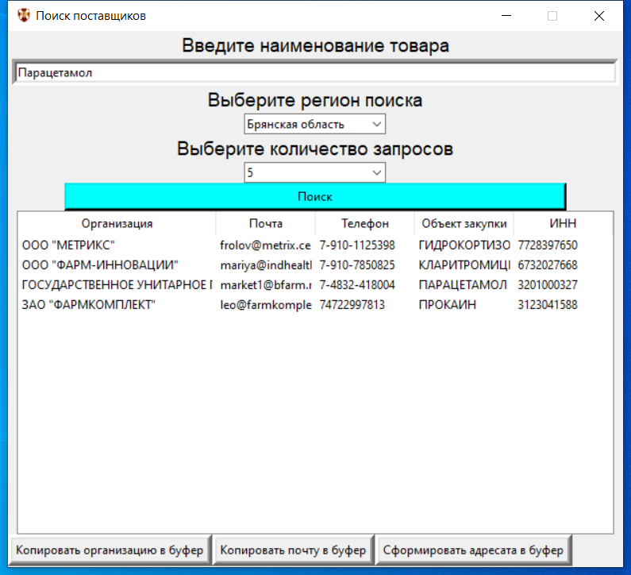

# Поиск поставщиков ЕИС в сфере закупок
Простое приложение на Tkinter для поиска релевантных поставщиков по объекту закупки и региону
> ***Приложение использует API ЕГРЮЛ, ЕИС в сфере закупок и ГосЗатраты (позволяет делать до 100 запросов в сутки с одного IP)***  
### Запуск на Windows
```bash
git clone https://github.com/Vofanchik/government-procurement.git
python -m venv venv
venv/Scripts/activate
pip install -r requirements
python Dealers search/Dealers_search.py
```
### Снимок экрана
